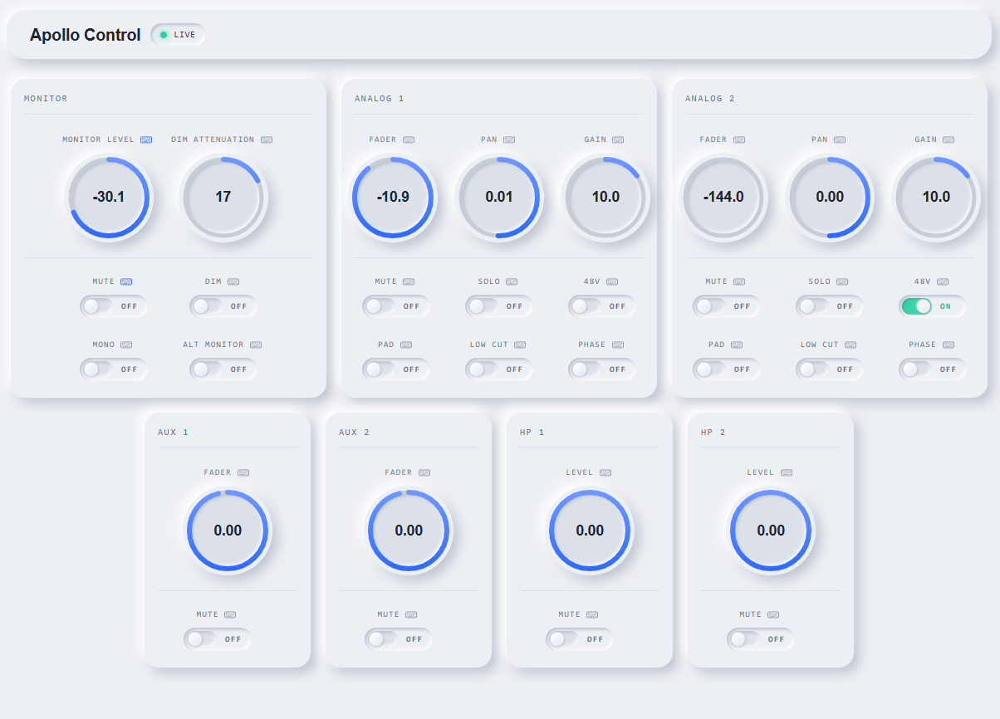

# Apollo Control

## The Problem

Universal Audio makes excellent audio interfaces, but their software story has a glaring gap: there is no way to control your Apollo from your computer. Want to turn down the monitor volume? Reach over and twist the physical knob. Need to enable phantom power for a condenser mic? Get up and tap the button on the device. Want to mute a channel mid-session? Hope you can reach it without disrupting your take.

For producers, engineers, and podcasters who spend hours in front of a screen, this is a constant friction point. Your hands are on your keyboard and mouse - not hovering over a hardware unit that may be rack-mounted, tucked behind a desk, or otherwise inconvenient to reach.

Apollo Control solves this by providing midi and computer keyboard mapping to control your device.

---
## Releases
### Windows

[Download Latest](/releases/20260512/Apollo%20Control_0.1.0_x64_en-US.msi)

### Mac OS
Will be very easy to create just waiting to see if there's any interest in the project first. (File an issue if you're interested)

---
## What It Does

Apollo Control is a software dashboard that gives you full, real-time control over your Apollo audio interface from your computer. The UI mirrors the actual state of your device and lets you adjust everything without touching the hardware.

### Monitor Section
- **Monitor Level** — Control your main speaker volume with a smooth dial
- **Dim** — Drop the monitor level by a fixed amount (great for talking to someone in the room)
- **Dim Attenuation** — Set how much the Dim function cuts the volume
- **Mute** — Kill the monitors entirely
- **Mono** — Collapse stereo to mono for mono compatibility checks
- **Alt Monitor** — Switch to an alternate monitor output

### Input Channels (Analog 1 & 2)
- **Gain** — Set mic/instrument preamp gain
- **Fader** — Channel volume in the mix
- **Pan** — Left/right positioning
- **48V Phantom Power** — Enable for condenser mics
- **Mute / Solo** — Standard channel control
- **Pad** — Reduce input level for loud sources
- **Low Cut** — Roll off low-frequency rumble
- **Phase** — Flip polarity to fix phase issues

### Aux Sends & Headphone Outputs
- **Aux 1 & 2** — Independent send levels for headphone mixes or external gear
- **HP 1 & HP 2** — Dedicated headphone output levels and mute

All values update in real time — if you change something on the physical device, the UI reflects it immediately, and vice versa.

---

## Keyboard Mapping

Apollo Control lets you control your Apollo using your computer keyboard — including the **media keys** on keyboards and external knobs that emit volume key events.

By default:
- **Shift + Volume Up** — Raise monitor level
- **Shift + Volume Down** — Lower monitor level
- **Shift + Volume Mute** — Toggle monitor mute

Custom keyboard mappings can be created for any control in the app. Mappings support modifier keys (Shift, Ctrl, Alt) for global hotkeys that work even when another app is in the foreground, or bare key mappings that activate when other apps are focused (so you don't interfere with normal typing).

This is especially useful if you have a **hardware knob or dial** — many of these emit standard media key events, so plugging one in gives you a physical volume knob that actually controls your Apollo monitors.

---

## MIDI Mapping

Apollo Control includes a full MIDI mapping system. Any MIDI controller — a fader board, a knob controller, a launchpad, a foot pedal — can be mapped to any parameter in the app.

Supported MIDI event types:
- **Control Change (CC)** — Ideal for knobs and faders; maps to continuous parameters like volume or gain
- **Note On / Note Off** — Ideal for buttons and pads; maps to toggles like mute and phantom power
- **Pitch Bend** — High-resolution control for precise adjustments

Each mapping can target a specific MIDI device and channel, or respond to any device on any channel. Mappings support several action modes:
- **Knob** — Continuous control that tracks the physical position of a fader or knob
- **Step** — Each trigger nudges a value up or down by a fixed amount
- **Toggle** — Flips a boolean on/off with each trigger
- **Hold** — Applies one value while held, reverts when released
- **Set** — Jumps directly to a specific value

Whether you're running a session with a full MIDI control surface or just want a single knob dedicated to monitor volume, the mapping system handles it.

---

## Live Status

The **LIVE** indicator in the top bar shows whether Apollo Control is actively connected to your Apollo. When connected, changes are reflected instantly in both directions — the UI stays in sync with the hardware at all times.
