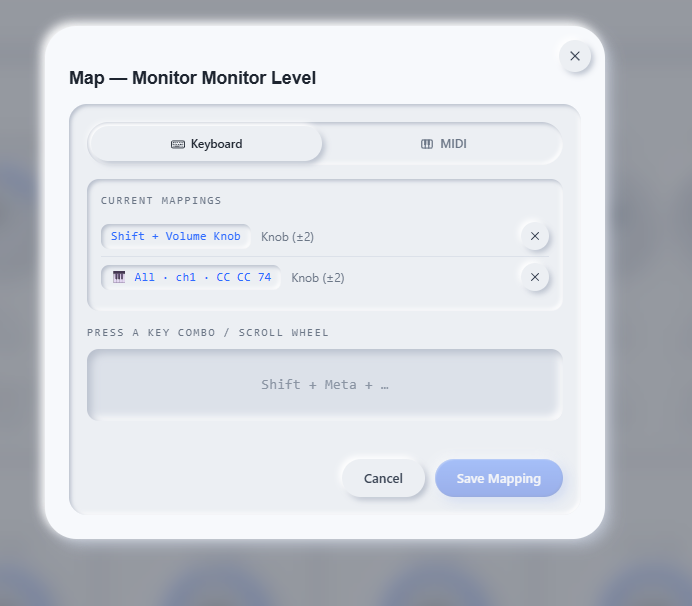

# Apollo Control

## The Problem

Universal Audio makes excellent audio interfaces, but controlling them from your computer is surprisingly limited.

If you want to adjust monitor volume, mute speakers, enable phantom power, switch monitors, or tweak headphone mixes, you typically have four options — and all of them introduce friction into your workflow.

### 1. Reach for the Hardware

The default workflow is physical control directly on the Apollo itself:
- Turn the monitor knob
- Press hardware buttons
- Navigate front-panel controls

That sounds fine until the device is:
- rack-mounted
- under a desk
- across the room
- built into a studio rack
- difficult to access mid-session

For producers, engineers, streamers, and podcasters, constantly reaching for the interface becomes unnecessary friction.

### 2. Open Console and Point-and-Click

Universal Audio’s Console software exposes many controls, but interacting with it means:
- switching windows
- finding the correct channel
- locating the right control
- clicking tiny UI elements during a session

That interruption breaks workflow, especially when recording, mixing, or live monitoring.

### 3. Use Default Keyboard Shortcuts

UAD does provide a few built-in keyboard shortcuts for monitor control, but they come with major limitations:
- shortcuts are fixed and not customizable
- only a small number of functions are supported
- you must remember the key combinations
- they aren't designed for personalized workflows
- they don't integrate well with custom hardware

For example:
- `Cmd + F12` → monitor volume up
- `Cmd + F11` → monitor volume down
- `Cmd + F10` → monitor mute

Useful — but extremely limited.

### 4. Limited MIDI Support

Modern studio workflows increasingly rely on MIDI controllers:
- fader banks
- rotary encoders
- macro pads
- foot pedals
- DAW control surfaces

But Apollo and Console provide little to no flexible MIDI mapping support.

Existing solutions are limited because they:
- only support specific Mackie-compatible devices
- require complicated third-party tools
- don't expose all Apollo controls
- break easily between updates
- are difficult to customize
- force users into predefined workflows

There is no native way to:
- map any MIDI device
- map arbitrary MIDI CCs
- create custom MIDI behaviors
- bind controls freely to Apollo parameters

If you want a dedicated physical monitor knob, custom mute button, or programmable control surface, you're mostly on your own.

---

## The Solution

Apollo Control gives you flexible, real-time control of your Apollo directly from your computer using:

- fully customizable keyboard shortcuts
- any MIDI controller or MIDI device
- external knobs, faders, foot pedals, and macro pads
- global hotkeys
- hardware control surfaces

Instead of adapting your workflow around the hardware, Apollo Control adapts the hardware to your workflow.

---

# Releases

## Windows

[Download Latest](https://github.com/jasonmcaffee/apollo-control/raw/master/releases/20260516/Apollo%20Control_0.3.0_x64_en-US.msi)

## macOS

macOS support should be straightforward to add — currently waiting to gauge interest in the project first.  
(File an issue if you'd like a macOS build.)

---

# What It Does

Apollo Control is a real-time software dashboard for Apollo audio interfaces.

The UI mirrors the live state of your device and allows full control without touching the hardware.

All changes stay synchronized in both directions:
- changing the hardware updates the UI instantly
- changing the UI updates the hardware instantly

---

# Monitor Section

- **Monitor Level** — Control main speaker volume
- **Dim** — Temporarily reduce monitor level
- **Dim Attenuation** — Configure dim reduction amount
- **Mute** — Silence monitor outputs
- **Mono** — Collapse stereo output to mono
- **Alt Monitor** — Switch between monitor outputs

---

# Input Channels (Analog 1 & 2)

- **Gain** — Mic/instrument preamp gain
- **Fader** — Channel mix level
- **Pan** — Stereo positioning
- **48V Phantom Power** — Condenser mic power
- **Mute / Solo** — Standard channel controls
- **Pad** — Reduce hot input levels
- **Low Cut** — Remove low-frequency rumble
- **Phase** — Flip polarity for phase correction

---

# Aux Sends & Headphone Outputs

- **Aux 1 & 2** — Independent cue/send mixes
- **HP 1 & HP 2** — Headphone output level and mute

---

# Keyboard Mapping

Apollo Control includes a fully customizable keyboard shortcut system.

Unlike UAD’s built-in shortcuts, any keyboard combination can be mapped to any control in the application.

This includes:
- standard keyboard shortcuts
- media keys
- macro pads
- external volume knobs that emit keyboard events
- programmable keyboards

## Default Shortcuts

By default:

- **Shift + Volume Up** → Increase monitor level
- **Shift + Volume Down** → Decrease monitor level
- **Shift + Volume Mute** → Toggle monitor mute

## Custom Mapping

Any control can be assigned to:
- single keys
- modifier combinations
- media keys
- global hotkeys

Mappings support:
- `Shift`
- `Ctrl`
- `Alt`
- multiple modifier combinations

Global shortcuts work even when Apollo Control is not focused.

This makes it possible to:
- control monitor volume while mixing in another DAW
- mute speakers instantly during recording
- create ergonomic shortcuts tailored to your workflow
- use external knobs as dedicated Apollo monitor controls

## Why This Matters

Default UAD shortcuts are:
- limited
- fixed
- non-customizable
- difficult to remember at scale

Apollo Control removes those constraints by letting you design controls around your setup instead of memorizing someone else’s.

---

# MIDI Mapping

Apollo Control includes a full MIDI mapping engine.

Any MIDI device can control any Apollo parameter.

Supported devices include:
- MIDI keyboards
- fader banks
- knob controllers
- Launchpads
- foot pedals
- control surfaces
- DIY MIDI hardware
- DAW controllers

No Mackie Control requirement.  
No predefined device whitelist.  
No special hardware support needed.

If your device can send MIDI, Apollo Control can map it.

## Supported MIDI Events

### Control Change (CC)

Perfect for:
- knobs
- faders
- expression pedals

Ideal for continuous parameters like:
- monitor volume
- gain
- headphone levels
- aux sends

### Note On / Note Off

Perfect for:
- buttons
- pads
- toggles

Ideal for:
- mute
- solo
- phantom power
- mono
- dim

### Pitch Bend

High-resolution continuous control for precision adjustments.

---

## MIDI Mapping Modes

Each mapping supports multiple interaction modes:

### Knob

Continuous tracking tied directly to hardware position.

### Step

Increment/decrement values by fixed amounts.

### Toggle

Flip states on/off.

### Hold

Apply a value while pressed and revert on release.

### Set

Jump directly to a predefined value.

---

## Why MIDI Matters

Without Apollo Control, MIDI workflows for Apollo devices are:
- unsupported or incomplete
- dependent on third-party hacks
- limited to Mackie-style integrations
- difficult to configure
- limited to specific hardware

Apollo Control allows:
- any MIDI device
- any MIDI channel
- any mapping configuration
- any Apollo control target

Whether you want:
- a single physical monitor knob
- a footswitch for talkback-style muting
- a full hardware mixing surface

Apollo Control handles it.

---

# Live Status

The **LIVE** indicator in the top bar shows connection status with your Apollo.

When connected:
- all changes synchronize instantly
- hardware and software remain in sync
- updates flow in both directions in real time